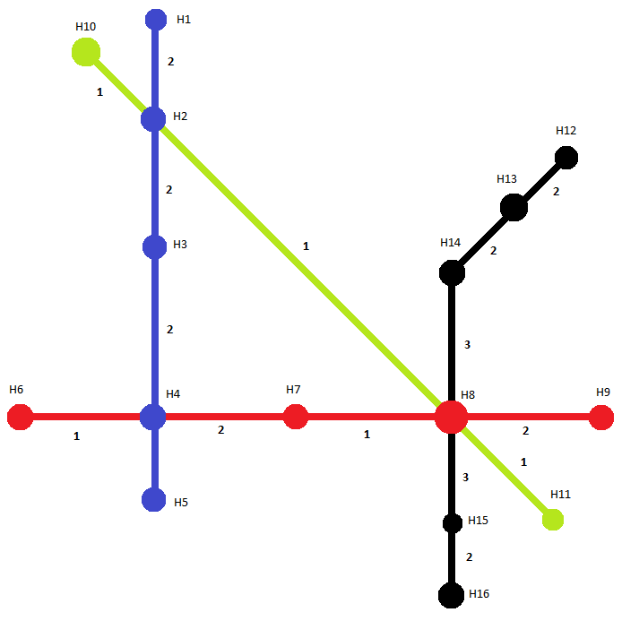

# Fahrplann TestSatzBrainstorming

## Beschreibung

Die Daten wurden anhand des [Brainstorming vom 02.01.2017](/Dokumentation/Brainstormings/2017/01_Januar/20170102) erstellt.

## Abbildung

## Haltestellen und Linien

Es existieren 16 Haltestellen und 10 Linien:

| Haltestelle | Linien |
| --- | --- |
| H1 | B11, B12 |
| H2 | B11, B12, B31, B32 |
| H3 | B11, B12 |
| H4 | B11, B12, B21, B22 |
| H5 | B11, B12 |
| H6 | B21, B22 |
| H7 | B21, B22 |
| H8 | B21, B22, B31, B32, B41, B42 |
| H9 | B21, B22 |
| H10 | B31, B32 |
| H11 | B31, B32 |
| H12 | B41, B42 |
| H13 | B41, B42 |
| H14 | B41, B42 |
| H15 | B41, B42 |
| H16 | B41, B42 |

### Linien

| Name | Ident |
| --- | --- |
| B11 | B11_SUED |
| B12 | B11_NORD |
| B21 | B11_OST |
| B22 | B11_WEST |
| B31 | B11_SUED |
| B32 | B11_NORD |
| B41 | B11_SUED |
| B42 | B11_NORD |

## Streckenabschnitte

Start = Start-Haltestelle
Ziel = Ziel-Haltestelle

| Start | Ziel | Dauer in Minuten |
| --- | --- | --- |
| H1 | H2 | 2 |
| H2 | H3 | 2 |
| H3 | H4 | 2 |
| H4 | H5 | 2 |
| H6 | H4 | 1 |
| H4 | H7 | 2 |
| H7 | H8 | 1 |
| H8 | H9 | 2 |
| H10 | H2 | 1 |
| H2 | H8 | 1 |
| H8 | H11 | 1 |
| H12 | H13 | 2 |
| H13 | H14 | 2 |
| H14 | H8 | 3 |
| H8 | H15 | 3 |
| H15 | H16 | 2 |

## Haltestellenfahrplaneinträge

### Haltestelle H1

#### Haltestelle H1 - Linie B11

| Stunde | Minuten |
| --- | --- |
| 00..23 | 00 |

### Haltestelle H2

#### Haltestelle H2 - Linie B11

| Stunde | Minuten |
| --- | --- |
| 00..23 | 03 |

#### Haltestelle H2 - Linie B12

| Stunde | Minuten |
| --- | --- |
| 00..23 | 14 |

#### Haltestelle H2 - Linie B31

| Stunde | Minuten |
| --- | --- |
| 00..23 | 36 |

#### Haltestelle H2 - Linie B32

| Stunde | Minuten |
| --- | --- |
| 00..23 | 14 |

### Haltestelle H3

#### Haltestelle H3 - Linie B11

| Stunde | Minuten |
| --- | --- |
| 00..23 | 06 |

#### Haltestelle H3 - Linie B12

| Stunde | Minuten |
| --- | --- |
| 00..23 | 11 |

### Haltestelle H4

#### Haltestelle H4 - Linie B11

| Stunde | Minuten |
| --- | --- |
| 00..23 | 09 |

#### Haltestelle H4 - Linie B12

| Stunde | Minuten |
| --- | --- |
| 00..23 | 08 |

#### Haltestelle H4 - Linie B21

| Stunde | Minuten |
| --- | --- |
| 00..23 | 15 |

#### Haltestelle H4 - Linie B22

| Stunde | Minuten |
| --- | --- |
| 00..23 | 53 |

### Haltestelle H5

#### Haltestelle H5 - Linie B12

| Stunde | Minuten |
| --- | --- |
| 00..23 | 05 |

### Haltestelle H6

#### Haltestelle H6 - Linie B21

| Stunde | Minuten |
| --- | --- |
| 00..23 | 13 |

### Haltestelle H7

#### Haltestelle H7 - Linie B21

| Stunde | Minuten |
| --- | --- |
| 00..23 | 18 |

#### Haltestelle H7 - Linie B22

| Stunde | Minuten |
| --- | --- |
| 00..23 | 50 |

### Haltestelle H8

#### Haltestelle H8 - Linie B21

| Stunde | Minuten |
| --- | --- |
| 00..23 | 20 |

#### Haltestelle H8 - Linie B22

| Stunde | Minuten |
| --- | --- |
| 00..23 | 48 |

#### Haltestelle H8 - Linie B31

| Stunde | Minuten |
| --- | --- |
| 00..23 | 40 |

#### Haltestelle H8 - Linie B32

| Stunde | Minuten |
| --- | --- |
| 00..23 | 12 |

#### Haltestelle H8 - Linie B41

| Stunde | Minuten |
| --- | --- |
| 00..23 | 49 |

#### Haltestelle H8 - Linie B42

| Stunde | Minuten |
| --- | --- |
| 00..23 | 32 |

### Haltestelle H9

#### Haltestelle H9 - Linie B22

| Stunde | Minuten |
| --- | --- |
| 00..23 | 50 |