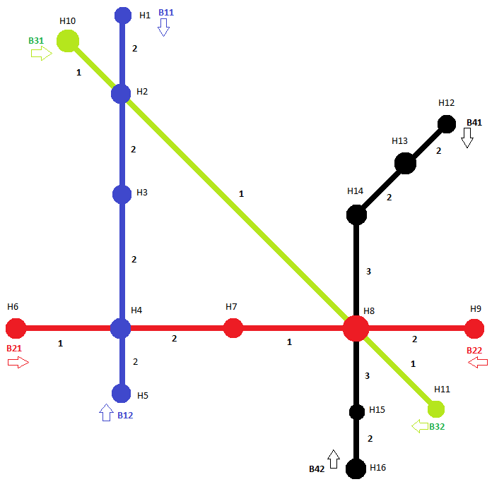

# Fahrplann TestSatzBrainstorming

## Beschreibung

Die Daten wurden anhand des [Brainstorming vom 02.01.2017](/Dokumentation/Brainstormings/2017/01_Januar/20170102) erstellt.

## Abbildung

## Haltestellen und Linien

Es existieren 16 Haltestellen und 10 Linien:

| Haltestelle | Linien |
| --- | --- |
| H1 | B11, B12 |
| H2 | B11, B12, B31, B32 |
| H3 | B11, B12 |
| H4 | B11, B12, B21, B22 |
| H5 | B11, B12 |
| H6 | B21, B22 |
| H7 | B21, B22 |
| H8 | B21, B22, B31, B32, B41, B42 |
| H9 | B21, B22 |
| H10 | B31, B32 |
| H11 | B31, B32 |
| H12 | B41, B42 |
| H13 | B41, B42 |
| H14 | B41, B42 |
| H15 | B41, B42 |
| H16 | B41, B42 |

## Streckenabschnitte

Start = Start-Haltestelle
Ziel = Ziel-Haltestelle

| Start | Ziel | Dauer in Minuten |
| --- | --- | --- |
| H1 | H2 | 2 |
| H2 | H3 | 2 |
| H3 | H4 | 2 |
| H4 | H5 | 2 |
| H6 | H4 | 1 |
| H4 | H7 | 2 |
| H7 | H8 | 1 |
| H8 | H9 | 2 |
| H10 | H2 | 1 |
| H2 | H8 | 1 |
| H8 | H11 | 1 |
| H12 | H13 | 2 |
| H13 | H14 | 2 |
| H14 | H8 | 3 |
| H8 | H15 | 3 |
| H15 | H16 | 2 |

## Haltestellenfahrplaneinträge

### Haltestelle H1

#### Linie B11

| Stunde | Minuten |
| --- | --- |
| 0 | 0 |
| 1 | 0 |
| 2 | 0 |
| 3 | 0 |
| 4 | 0 |
| 5 | 0 |
| 6 | 0 |
| 7 | 0 |
| 8 | 0 |
| 9 | 0 |
| 10 | 0 |
| 11 | 0 |
| 12 | 0 |
| 13 | 0 |
| 14 | 0 |
| 15 | 0 |
| 16 | 0 |
| 17 | 0 |
| 18 | 0 |
| 19 | 0 |
| 20 | 0 |
| 21 | 0 |
| 22 | 0 |
| 22 | 0 |
| 23 | 0 |